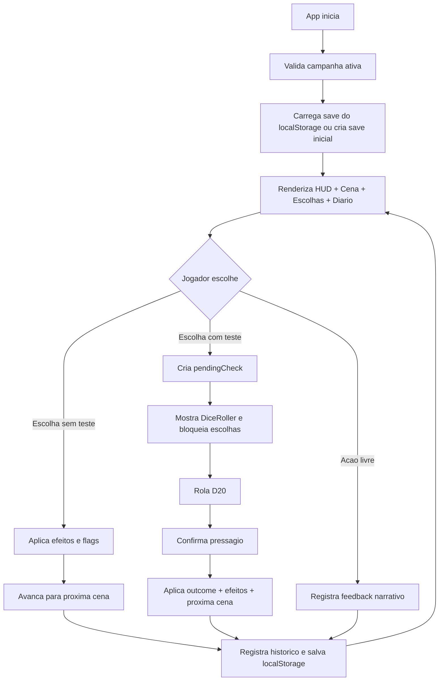
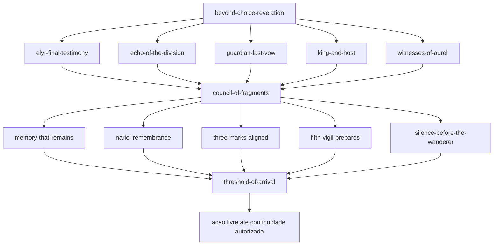

# Fluxo entre telas e cenas

## Fluxo de interface

## Fluxo narrativo atual

## Regras de transicao

- A cena inicial e `activeSceneId`.
- Uma escolha comum avanca para `choice.nextSceneId` ou, se ausente, para `scene.nextSceneId`.
- Uma escolha com `check` cria `pendingCheck` e so avanca apos a confirmacao da rolagem.
- Uma escolha com `action: "free"` nao muda cena.
- `flagsSet` da escolha e da cena sao adicionadas ao save sem duplicar.
- `flagsRequired` em escolhas filtra opcoes visiveis.
- `flagsRequired` em cenas existe no modelo, mas o app atual nao bloqueia diretamente a renderizacao por cena.

